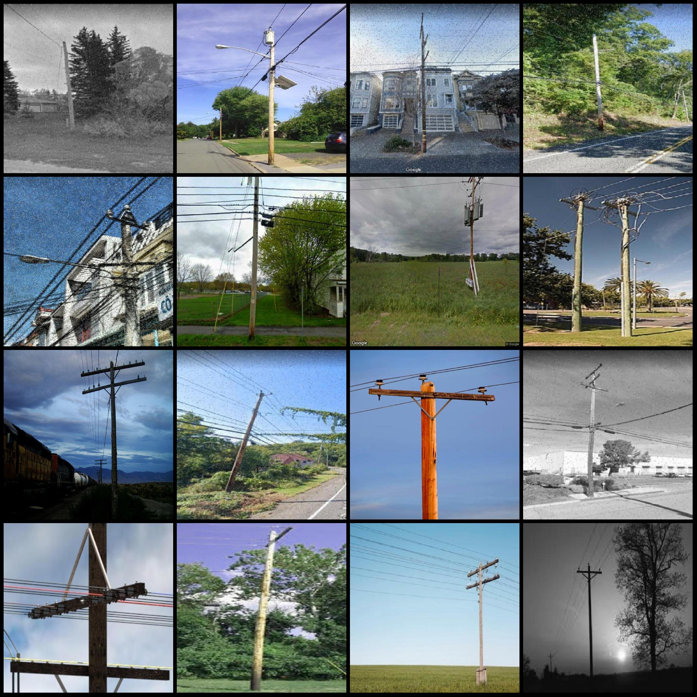
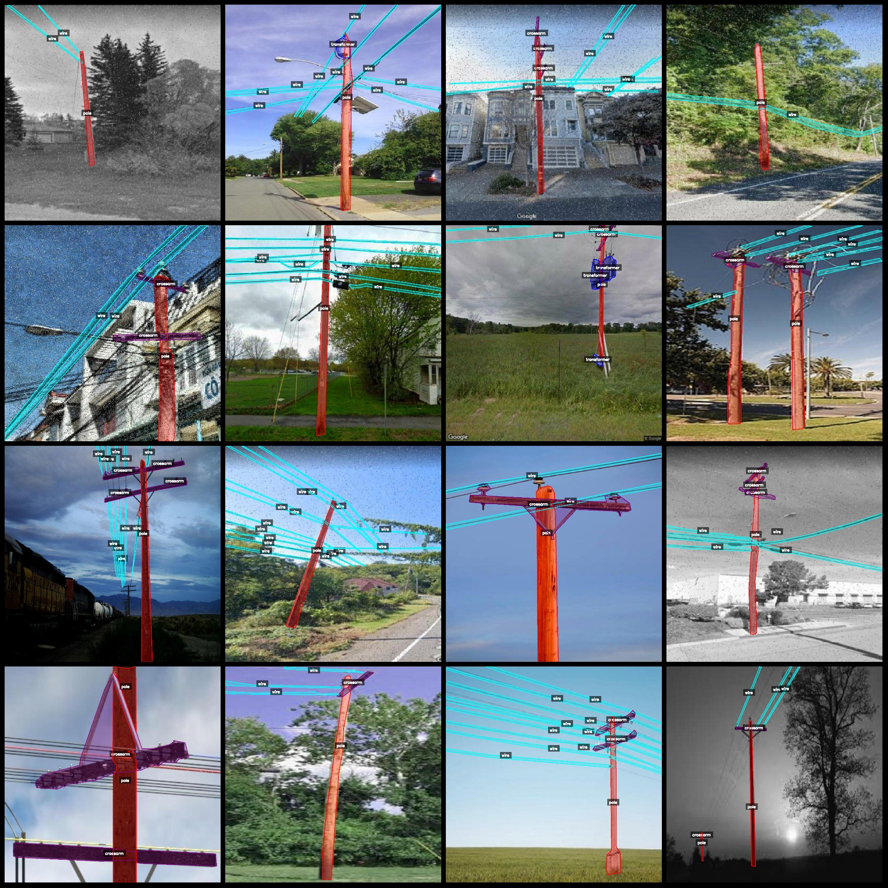
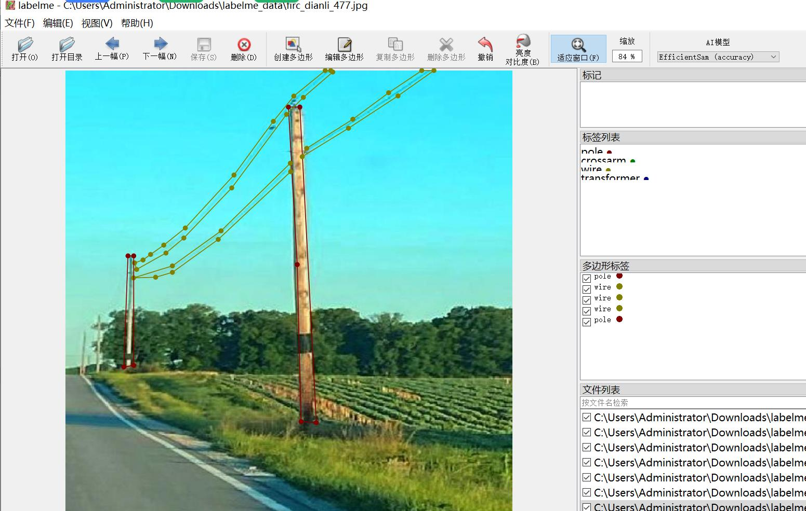

# Power Scene Transmission Line Electrical Parts Identification and Segmentation Dataset (LabelMe format, 2522 images in 5 categories)

Dataset format: LabelMe format (without mask files, only containing jpg images and corresponding json files)
Number of images (number of jpg files): 2522
Number of labeling (json file count): 2522
Number of labeling categories: 5
Labeling category names: ["pole", "crossarm", "wire", "transformer", "pedestal"]
Number of boxes per category:
- pole (electric pole) count = 2550
- crossarm (horizontal arm) count = 3190
- wire (conductor) count = 11828
- transformer (transformer) count = 854
- pedestal (base/support) count = 335
Total box count: 18757

Annotation tool used: labelme=5.5.0
Repository location: firc-dataset
Image resolution: 1024x1024
Dataset enhancement: Yes, mainly salt and pepper noise and contrast enhancement, about one-third is original images and the rest are enhanced images
Annotation rules: Polygon drawing for each category

Important note: The dataset can be opened and edited with LabelMe, but the json dataset needs to be converted into mask or Yolo format or COCO format for semantic segmentation or instance segmentation.
Special declaration: This dataset does not guarantee any accuracy of the trained models or weight files.

Image preview:
Original image:
Annotation drawing result:
LabelMe editing example image:

## Images

Here is a pay link on Stripe ( https://buy.stripe.com/3cs8yP7sY87d0vu9AB ). Please contact me lonlonago@foxmail.com after funding $89, and I will send you a complete data files , thank you!

